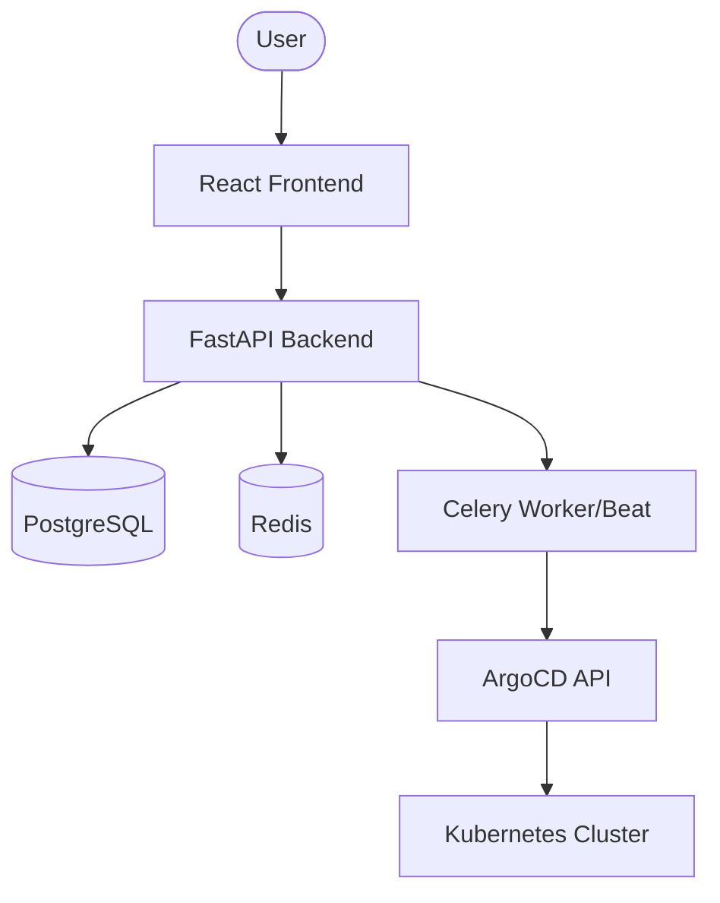

# Architecture Overview

Mindweaver is designed as a modular platform for data infrastructure orchestration.

## High-Level Architecture

The platform consists of several interconnected components:

## Backend Components

### Framework (`fw`)
Located in `backend/src/mindweaver/fw/`, this layer provides the core abstractions for the platform:
- **`model.py`**: Base classes for SQLModel definitions (`NamedBase`, `ProjectScopedNamedBase`).
- **`service.py`**: The `Service` class, which handles CRUD operations and routing automation.
- **`platform.py`**: The `PlatformService` class, designed specifically for managing external infrastructure components.

### Platform Services
Located in `backend/src/mindweaver/platform_service/`, these services manage the lifecycle of external data components. They use Jinja2 templates (`backend/src/mindweaver/templates/`) to generate Kubernetes manifests.

### Task Orchestration
Mindweaver uses **Celery** for long-running and scheduled tasks (e.g., syncing with ArgoCD, running ingestion jobs). **Redis** serves as the broker and result backend.

## Frontend Components

The frontend is a modern React application that dynamically adapts to the backend's metadata.

### Dynamic Forms
Mindweaver uses a reflection-based form system. The frontend fetches JSON:API schemas and metadata from the backend to automatically render forms using the `DynamicForm` component.

### Providers
Providers manage the communication between the UI and the backend API, abstracting away the details of network requests.

## Deployment Model

Mindweaver follows a GitOps-like approach by generating manifests and using **ArgoCD** to ensure that the actual state of the Kubernetes cluster converges with the desired state defined in Mindweaver.
